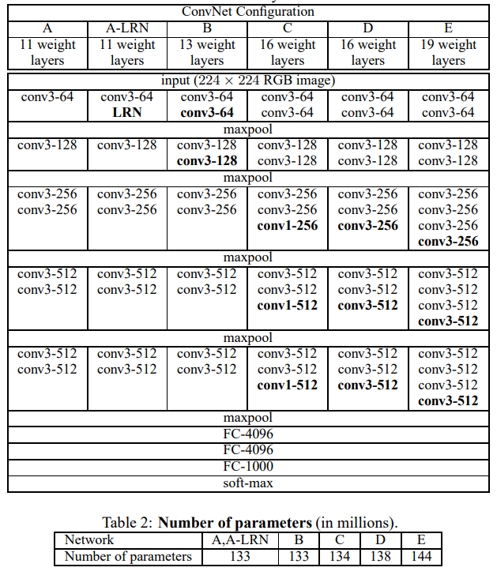

[Original Paper -- VERY DEEP CONVOLUTIONAL NETWORKS FOR LARGE-SCALE IMAGE RECOGNITION](https://arxiv.org/pdf/1409.1556.pdf)
# Introduction
- There have been attempts to improve the original ConvNet architecture to achieve better accuracy, including smaller receptive window size, smaller stride of the first convolutional layer, and training the network densely over multiple scales.
- ==This paper addresses the depth aspect of ConvNet architecture design by steadily increasing the depth of the network by adding more convolutional layers.==
- The authors present significantly more accurate ConvNet architectures that achieve state-of-the-art accuracy on ILSVRC classification and localization tasks and are applicable to other image recognition datasets

# Architecture:
- The input to the ConvNets is a fixed-size 224 x 224 RGB image.
- Pre-processing involves subtracting the mean RGB value from each pixel.
- The image is passed through a stack of convolutional layers with ==3x3 receptive field filters== and 1x1 linear transformation filters.
- Convolution ==stride is fixed to 1 pixel==, with ==1 pixel spatial padding to preserve spatial resolution==.
- ==Max-pooling is performed over a 2x2 pixel window with stride 2==, after some of the convolutional layers.
- The network includes three fully-connected layers with 4096 channels each, and a 1000-way ILSVRC classification layer.
- The final layer is the soft-max layer.
- All hidden layers include the rectification (ReLU) non-linearity

## Configuration
- Instead of using large receptive fields in the first conv. layers, we use small 3 × 3 receptive fields throughout the whole net.
- A stack of three 3 × 3 conv. layers has an effective receptive field of 7 × 7, but ==with the advantage of three non-linear rectification layers==.
- The ==use of 3 × 3 conv. layers decreases the number of parameters== compared to using a single 7 × 7 layer.
- The incorporation of ==1 × 1 conv. layers increases the non-linearity of the decision function without affecting the receptive fields==.
- The 1 × 1 convolution is essentially a linear projection but with added non-linearity from the rectification function.
- The use of 1 × 1 conv. layers has been recently utilized in the "Network in Network" architecture.

 

 # Training
- The ConvNet training procedure follows the procedure outlined by Krizhevsky et al. (2012), using mini-batch gradient descent with momentum and weight decay for regularization.
- The batch size is set to 256, momentum to 0.9, and weight decay to 5x10^-4.
- Dropout regularization is applied to the first two fully-connected layers with a ratio of 0.5.
- The learning rate is initially set to 10^-2 and decreased three times when the validation accuracy stops improving.
- The training was stopped after 74 epochs, 370K iterations.
- The network weights are initialized with a normal distribution with zero mean and 10^-2 variance, except for the first four convolutional layers and last three fully-connected layers which are initialized with the shallow network configuration A.
- The input images are randomly cropped, horizontally flipped and subjected to random RGB color shifts to augment the training set

## Image
- The crop size is fixed at 224 x 224, but S can be any value greater than or equal to 224. If S = 224, the crop will contain the entire image. If S is much greater than 224, the crop will only contain a small part of the image.
- ==Two approaches to setting S are considered: single-scale training and multi-scale training.==
- Single-scale training involves fixing S at a specific value (256 or 384 in this case). The first network is trained with S = 256, and the second network with S = 384 is initialized with the weights from the first network.
- Multi-scale training involves randomly sampling S from a range [Smin, Smax] for each training image (Smin = 256, Smax = 512 in this case). This allows the model to be trained to recognize objects at different scales.
- The multi-scale model is trained by fine-tuning all layers of a single-scale model (pre-trained with S = 384) for efficiency reason