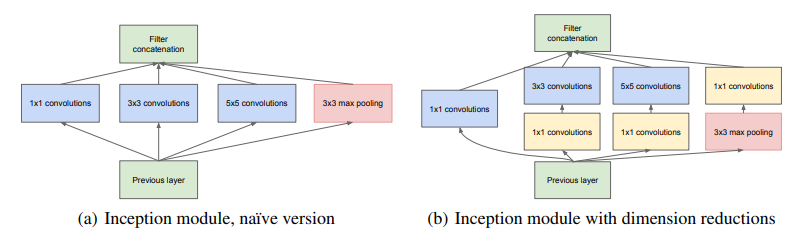
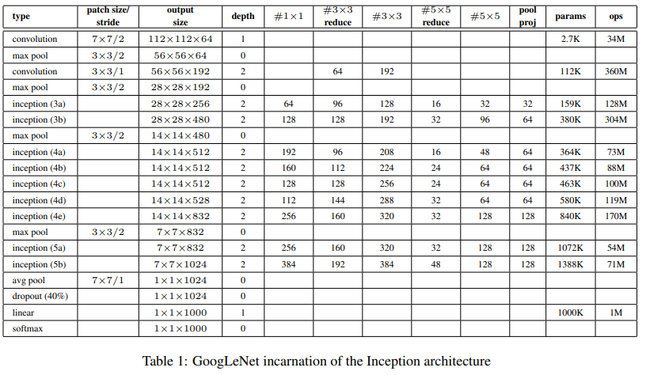

[Original Paper --- Going deeper with convolutions](https://arxiv.org/pdf/1409.4842.pdf)   

# Introduction

**Background information:** Advances in deep learning, specifically convolutional networks, have greatly improved the quality of image recognition and object detection in recent years. The improvement is due to new ideas, algorithms, and improved network architectures, not just better hardware and larger datasets. The focus of the research is on efficient deep neural network architecture for computer vision.

**Problem statement:** The power and memory use of algorithms are important in the age of mobile and embedded computing. ==The focus of the research is on designing algorithms that are efficient, not just accurate.==

**Purpose of the study:** To introduce a new ==deep neural network architecture called "Inception"== that is both logically advanced and efficient.

# Related Works:

**Literature Review:** The LeNet-5 is the starting point for CNNs and the standard structure involves stacked convolutional layers followed by fully connected layers. Variants of this design have yielded the best results on various image classification challenges. There is a trend towards increasing the number of layers and layer size for larger datasets, and using dropout to address overfitting. The same CNN architecture has also been used successfully for other tasks like localization, object detection, and human pose estimation. ==The Inception model, inspired by the primate visual cortex, uses learned Gabor filters of different sizes to handle multiple scales. The Network-in-Network approach increases the representational power of neural networks.==

# Motivation

## Improving the Performance of Deep Neural Networks
- The most straightforward way to improve the performance of deep neural networks is by ==increasing their size, including both the depth and width==.
- Bigger size typically results in a larger number of parameters and makes the network more ==prone to overfitting,== especially if the number of labeled examples in the training set is limited.
- ==The increased use of computational resources== is another drawback of uniformly increasing network size.
## Solution to the Drawbacks
- Solving both issues is by moving from ==fully connected to sparsely connected architectures==.
- Arora et al. suggests that the optimal network topology can be constructed layer by layer by analyzing the ==correlation statistics of the activations.==
> Correlation between the outputs of different neurons in the same layer of a network. This correlation information can be used to analyze the topology of a network and to determine the optimal network structure layer by layer by ==clustering neurons with highly correlated outputs==
- The theory resonates ==Hebbian principle "Cells that fire together, wire together".==
## Inefficient Computing Infrastructures for Sparse Data Structures
- Today's computing infrastructures are very inefficient when it comes to numerical calculation on non-uniform sparse data structures.
- The overhead of lookups and cache misses is dominant, even if the number of arithmetic operations is reduced by 100x.
- The gap is widened by the use of highly tuned numerical libraries that allow for extremely fast dense matrix multiplication.
## Utilizing Sparsity in Deep Learning Architectures
- The Inception architecture started as a case study for ==assessing the hypothetical output of a network topology construction algorithm that tries to approximate a sparse structure.==

# Architectural Details

## Introduction to the Inception Architecture
- The Inception architecture is based on ==finding the optimal local sparse structure in a convolutional vision network.==
- The architecture consists of ==stacking "Inception modules" on top of each other, with occasional max-pooling layers to halve the resolution.==
- The modules allow for increasing the number of units and stages, with the ==use of dimension reduction and projections to balance computational complexity.==
## Layer-by-layer Construction

- The ==correlation statistics of the last layer are analyzed and clustered into groups of high correlation.==
- In the lower layers, ==correlated units are concentrated in local regions, covered by a layer of 1x1 convolutions.==
- In the higher layers, ==the ratio of 3x3 and 5x5 convolutions increases as the features become more abstract.==
## Problem with Naive Form of Inception Modules
- The number of 5x5 convolutions can be expensive on top of a layer with a large number of filters.
- The merging of the pooling layer with the convolutional layers leads to an increase in the number of outputs from stage to stage.
- This leads to a computational blow-up within a few stages, making the architecture inefficient.
## Solution to the Problem
- ==Dimension reductions and projections are applied to reduce computational requirements.==
- ==1x1 convolutions are used to compute reductions before expensive 3x3 and 5x5 convolutions==.
- The use of dimension reduction allows for increasing the number of input filters and stages.
- The architecture aligns with the intuition that visual information should be processed at various scales and then aggregated.

# GoogLeNet  

**Network Design:**
The network was designed with computational efficiency and practicality in mind, so that it can run on individual devices with limited computational resources and low-memory footprint. ==The network is 22 layers deep==

**Use of Rectified Linear Activation:**
All convolutions in the network, including those inside the Inception modules, use rectified linear activation. The reduction and projection layers use rectified linear activation as well.

**Receptive Field and Input:**
The size of the receptive field in the network is 224x224, taking RGB color channels with mean subtraction. The number of 1x1 filters used in the reduction layer and projection layer are specified in the table.

**Average Pooling and Classifier:**
The use of average pooling before the classifier is based on [12], and ==the network has an extra linear layer to allow for easy adaptation and fine-tuning for other label sets.== The move from fully connected layers to average pooling improved the top-1 accuracy by about 0.6%, but dropout remained essential.

**Gradient Propagation and Regularization:**
Given the network's large depth, the ability to propagate gradients effectively was a concern. To encourage discrimination in the lower stages of the classifier and ==increase gradient signal, auxiliary classifiers were added to intermediate layers.== These classifiers are smaller convolutional networks added to the output of the Inception (4a) and (4d) modules.

**Auxiliary Classifier:**
The auxiliary classifier has an average pooling layer, a 1x1 convolution with 128 filters, a fully connected layer with 1024 units, a dropout layer with 70% dropped outputs, and a linear layer with softmax loss as the classifier. ==The auxiliary network is discarded at inference time==