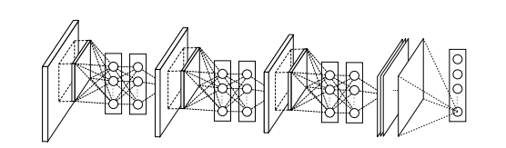

# Introduction
- CNNs consist of alternating convolutional layers and pooling layers.
- The convolution filter in CNN is a GLM (generalized Linear Model) that performs low-level abstraction.
- The assumption of the conventional CNN is that latent concepts are linearly separable.
- ==NIN replaces GLM== with a "micro network" structure, a multilayer perceptron (MLP), ==to enhance abstraction ability.  (non linearity)==
- NIN consists of stacking multiple mlpconv layers.
- In NIN, ==global average pooling is used for classification instead of fully connected layers, which is more meaningful and interpretable.==
- Global average pooling also acts as a structural regularizer to prevent overfitting.

# CNN
- Classic convolutional neuron networks consist of convolutional and spatial pooling layers
- ==Convolutional layers generate feature maps through linear convolutional filters and nonlinear activation functions==
- Conventional CNNs use an over-complete set of filters to cover variations of latent concepts
- Maxout networks reduce number of feature maps by maximum pooling over affine feature maps, making it a more potent function approximator compared to conventional CNNs
- ==Maxout network assumes instances of a latent concept lie within a convex set in input space==
- Network in Network (NIN) is introduced as a novel structure with a micro network within each convolutional layer to compute more abstract features for local patches
- NIN is different from previous sliding network structures as it is designed from a more general perspective to improve abstraction for all levels of features

# Network in Network

## MLP Convolution Layers
- The conventional convolutional layers do not always perform well when the distributions of the latent concepts (hidden patterns in the data) are complex and nonlinear. To address this issue, ==NIN introduces a micro network within each convolutional layer to extract more abstract features from local patches.==
- Compared to previous works such as Structured Multilayer Perceptron (SMLP) and neural network based filter, NIN is designed from a more general perspective and aims to provide better abstraction for all levels of features. The micro network in ==NIN uses multilayer perceptron (MLP) as the universal function approximator for feature extraction, which has the capability of approximating complex distributions of the latent concepts.==
- The MLP in NIN replaces the conventional linear convolution in convolutional layers, which performs weighted linear recombination of the input feature maps through a rectifier linear unit. The cross channel pooling structure allows complex and learnable interactions of cross channel information, and is equivalent to a convolution layer with ==1x1 convolution kernel which perform the MLP operation.==
- On the other hand, the maxout network, which NIN compares to, performs max pooling across multiple affine feature maps to form separation hyperplanes for concepts whose samples are within a convex set. The maxout network assumes that instances of the latent concepts lie within a convex set in the input space, which may not always be true. By replacing the max pooling with a universal function approximator (MLP), NIN aims to provide more general and robust abstraction for complex distributions of the latent concepts

##  Global Average Pooling

- Conventional convolutional neural networks (CNN) consist of convolutional layers and fully connected layers. The convolutional layers are used as feature extractors while the fully connected layers are used for classification. However, the fully connected layers are prone to overfitting and can harm the generalization ability of the overall network. To address this issue, the strategy of dropout has been proposed by Hinton et al. where random activations in the fully connected layers are set to zero during training.
- In this paper, another strategy called ==global average pooling is proposed to replace the traditional fully connected layers in CNN==. ==The idea is to generate one feature map for each category of the classification== task in the last multilayer perceptron convolutional (mlpconv) layer. Instead of adding fully connected layers on top of the feature maps, the average of each feature map is taken and fed directly into the softmax layer.
- Advantages of global average pooling over fully connected layers include:  
  - Correspondences between feature maps and categories are more native to the convolution structure
  - Feature maps can be interpreted as confidence maps of concepts (categories)
  - No parameters to optimize, avoiding overfitting at this layer
  - Spatial information is summed out, making it more robust to spatial translations of the input
- Global average pooling can be seen as a structural regularizer that enforces feature maps to be confidence maps of concepts, made possible by the mlpconv layers that make better approximations to the confidence maps than GLMs.

